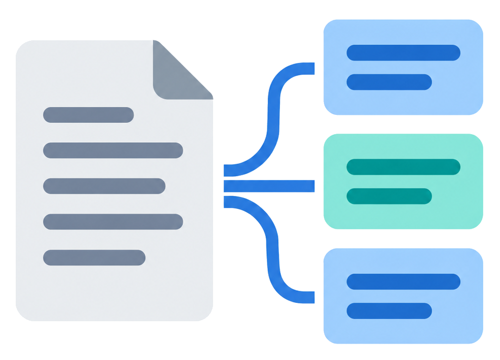

[](https://www.nuget.org/packages/TextChunker/)

# TextChunker

TextChunker turns text, streams, files, lists, and tables into clean, token sized chunks for retrieval
augmented generation and embedding pipelines. It counts tokens with real tokenizers rather than
character heuristics, guarantees no chunk ever exceeds your budget, and hands back a chunk that already
knows its parent, its ordinal, its token count, and where it came from in the source.

It targets `net8.0`, `net10.0`, and `netstandard2.0` and ships as a single NuGet package with a symbol
package. The `netstandard2.0` target extends reach to .NET Framework 4.6.1+, older Unity runtimes, and
Xamarin.

## Why it exists

Most chunkers make you choose between correct token counting and a clean API. TextChunker gives you
both. The token budget is enforced by re encoding every slice and shrinking it until it provably fits,
so a 512 token limit means 512 tokens, not an estimate that overflows the moment you send it to a model.
The tokenizer is pluggable: cl100k for OpenAI style models and BERT WordPiece for MiniLM, BGE, and E5,
with the vocabulary embedded in the assembly so counts are correct offline with no external file.

The result object was designed to survive the trip into a vector store. Each chunk carries a parent
identifier, a zero based ordinal, its token and character counts, and, for text strategies, the exact
character offsets back into the source. You can group by parent, order by position, re embed, and cite a
passage without building a second data structure alongside the chunks.

## Install

```
dotnet add package TextChunker
```

## Quick start

The API is asynchronous and streams chunks as they are produced. Passing `null` options uses sensible
defaults.

```csharp
using TextChunker.Chunking;
using TextChunker.Models;
using TextChunker.Enums;

IChunker chunker = new Chunker();

// ChunkingOptions carries every chunking parameter. These are the common ones; see docs/API.md for the
// full set. Passing null instead of an options object uses sensible defaults.
ChunkingOptions options = new ChunkingOptions
{
    Strategy = ChunkStrategyEnum.FixedTokenCount, // FixedTokenCount, Recursive, SentenceBased, ParagraphBased, RegexBased, list, or table
    MaxTokens = 512,                              // target chunk size in tokens
    OverlapCount = 64,                            // token overlap between chunks (or OverlapPercentage, or OverlapCharacters)
    ModelId = "text-embedding-3-small",           // resolves the tokenizer family and token budget for your model
    ComputeOffsets = true,                        // record each chunk's start and end character offsets in the source
    ComputeHashes = false                         // optionally attach MD5, SHA1, and SHA256 to each chunk
};

await foreach (Chunk chunk in chunker.ChunkText("Your document text goes here.", options))
{
    Console.WriteLine($"[{chunk.Position}] {chunk.TokenCount} tokens: {chunk.Text}");
}
```

Three entry points cover unstructured input, and the file overload carries its access mode so you
control sharing and encoding.

```csharp
// From a stream (the stream is read but not disposed)
await foreach (Chunk c in chunker.ChunkStream(stream, options)) { }

// From a file, with an access mode
await foreach (Chunk c in chunker.ChunkFile("notes.md", options,
    new FileChunkingOptions { AccessMode = FileAccessModeEnum.SharedRead })) { }
```

Structured content that carries shape uses its own entry points, because a flat string cannot express a
table's rows or a list's items.

```csharp
// A list, driving the ListEntry or WholeList strategy
await foreach (Chunk c in chunker.ChunkList(new[] { "first", "second", "third" }, ordered: false, options)) { }

// A table, where row zero is the header
var rows = new List<IReadOnlyList<string>>
{
    new[] { "Name", "Role" },
    new[] { "Ada", "Engineer" }
};
await foreach (Chunk c in chunker.ChunkTable(rows,
    new ChunkingOptions { Strategy = ChunkStrategyEnum.RowWithHeaders })) { }
```

When you want everything at once instead of a stream, `ChunkToResultAsync` returns the chunks plus run
level diagnostics, and the synchronous `Chunk(text, options)` convenience method drains the stream to a
list.

## Strategies

| Strategy | Input | Behavior |
|---|---|---|
| `FixedTokenCount` | text | Sliding token window with optional overlap |
| `Recursive` | text | Recursively splits on a separator ladder, then merges to fill the budget |
| `SentenceBased` | text | Groups whole sentences up to the budget |
| `ParagraphBased` | text | Groups paragraphs, falling back to sentences when one is too large |
| `RegexBased` | text | Splits on your pattern, guarded by a timeout |
| `WholeList` | list | The whole list as one chunk, split by line if it overflows |
| `ListEntry` | list | One chunk per item |
| `Row` | table | Each data row as space joined values |
| `RowWithHeaders` | table | Each data row as a small markdown table |
| `RowGroupWithHeaders` | table | Groups of rows as a markdown table |
| `KeyValuePairs` | table | Each row as `header: value` pairs |
| `WholeTable` | table | The whole table as one markdown table |

Every strategy degrades gracefully. A paragraph larger than the budget becomes sentences, an oversized
sentence becomes token spans, and an oversized table group becomes rows, then cells, then token spans.
Cell values that contain a pipe are escaped so serialized markdown stays intact.

The `Recursive` strategy is the one to reach for on structured text. It walks a ladder of separators
(paragraph, line, sentence, word by default) and only descends to a finer split when a piece still
overflows, then merges neighbors back up to the budget. Set `Format` to `Markdown`, `CSharp`, `Python`,
`JavaScript`, or `Java` to prefer headings or code declarations as split points, or supply your own
`Separators` list.

Overlap can be expressed three ways. `OverlapCount` is a token count, `OverlapPercentage` is a fraction
of the chunk size, and `OverlapCharacters` is a character count converted to an approximate token
overlap. Percentage wins over characters, which wins over count when more than one is set.

## Tokenizers and budgets

The chunker resolves a tokenizer and a token budget once per call. By default it uses cl100k. Set a
`ModelId` or an `ApiFormat` and it picks the right family and budget. Common embedding models are known
out of the box, so their exact tokenizer and sequence length are applied automatically: `nomic-embed-text`
to WordPiece at 2048, `all-minilm` to WordPiece at 256, `all-mpnet-base-v2` to WordPiece at 384, and
`bge`, `gte`, `e5`, and `mxbai-embed-large` to WordPiece at 512. A provider path prefix
(`sentence-transformers/...`) or a version or quantization tag (`nomic-embed-text:v1.5`) is stripped
before matching. Beyond the known models, OpenAI and vLLM resolve to cl100k at 8192, GPT-4o and o-series
names to o200k, Gemini to cl100k at 2048, and any other BERT family name to WordPiece at 512. Add or
override entries with `TokenizationDefaults.RegisterKnownModel` at startup.

For a tokenizer the resolver does not know, wrap any `Microsoft.ML.Tokenizers` tokenizer (a Hugging Face
JSON tokenizer, or a SentencePiece model for Llama or Gemma) in `MlTokenizerAdapter` and hand it to the
`Chunker` constructor, so token counts match your exact model.

```csharp
ChunkingOptions options = new ChunkingOptions
{
    Strategy = ChunkStrategyEnum.SentenceBased,
    MaxTokens = 256,
    ModelId = "all-minilm"   // resolves to BERT WordPiece, 256 token model budget
};
```

The actual budget enforced is the smaller of your `MaxTokens` and the model's limit, so a chunk never
exceeds either. If you host models behind an endpoint that reports a different limit, implement
`ITokenizerCalibrationProbe` and pass it to the chunker to discover the true budget at runtime. The core
package opens no network connections on its own.

## The chunk

```csharp
public class Chunk
{
    public Guid GUID;              // unique per chunk
    public Guid? ParentGUID;       // parent identifier, or null when no parent was supplied
    public int Position;           // zero based ordinal within the parent
    public string Text;
    public int TokenCount;
    public int CharacterCount;
    public int StartOffset;        // source offset, or -1 for serialized list/table output
    public int EndOffset;
    public ChunkStrategyEnum Strategy;
    public string TokenizerModel;
    public string? HeaderContext;  // breadcrumb when hierarchy aware
    public List<string> Labels;
    public Dictionary<string, string> Tags;
    public List<float> Embeddings; // reserved for a downstream embedder
    public byte[]? MD5Hash, SHA1Hash, SHA256Hash;
}
```

Offsets, hashes, and token counts are each optional, controlled by their own flag. `ComputeOffsets` and
`ComputeTokenCounts` are on by default; `ComputeHashes` is off. Each one does real work per chunk: token
counting runs the tokenizer again, hashing computes three digests over the chunk bytes, and offset
resolution searches the source for the chunk. Turn off whatever you do not need and it is not computed.

## Hierarchy aware chunking

Turn on `HierarchyAware` and TextChunker parses a markdown header tree, chunks each section, and stamps
every chunk with a breadcrumb such as `Guide > Setup > Windows` in `HeaderContext`. Set
`ContextualizeHeaders` to prepend that breadcrumb into the chunk text itself for better embeddings; its
token cost is charged against the budget rather than silently inflating the chunk.

## Dependency injection

Register the chunker once and inject `IChunker` wherever you need it. `AddTextChunker` registers a single
`Chunker` as a singleton; it holds no per-call state and is safe to share across threads. It depends only
on `Microsoft.Extensions.DependencyInjection.Abstractions`, so it pulls in no DI runtime of its own.

```csharp
using Microsoft.Extensions.DependencyInjection;
using TextChunker.Chunking;
using TextChunker.DependencyInjection;
using TextChunker.Enums;
using TextChunker.Models;
using TextChunker.Tokenization;

IServiceCollection services = new ServiceCollection();

// Default: resolve the tokenizer per call from ChunkingOptions (ModelId / TokenizerKind / ApiFormat).
services.AddTextChunker();

// Or always use one specific tokenizer, skipping model resolution.
services.AddTextChunker(new SharpTokenTokenizerAdapter("o200k_base"));

// Or resolve tokenizers from options but calibrate the token budget against a live endpoint.
services.AddTextChunker(new MyCalibrationProbe());
```

All three overloads register `IChunker`. Consume it by constructor injection; `ChunkingOptions` stays a
per-call argument, so one registered chunker serves every strategy and model in your application:

```csharp
public sealed class DocumentIndexer
{
    private readonly IChunker _Chunker;

    public DocumentIndexer(IChunker chunker)
    {
        _Chunker = chunker;
    }

    public async Task IndexAsync(string text, CancellationToken token)
    {
        ChunkingOptions options = new ChunkingOptions { Strategy = ChunkStrategyEnum.Recursive, MaxTokens = 512 };
        await foreach (Chunk chunk in _Chunker.ChunkText(text, options, token))
        {
            // embed and store chunk.Text, keyed by chunk.ParentGUID and chunk.Position
        }
    }
}
```

## Microsoft.Extensions.DataIngestion

The companion package `TextChunker.Extensions.DataIngestion` lets TextChunker serve as the chunking stage
of a `Microsoft.Extensions.DataIngestion` pipeline. It implements `IngestionChunker<string>`, so it slots
in next to Microsoft's readers, enrichers, and vector-store writers, and it carries TextChunker's metadata
(position, token count, offsets, strategy, header context) onto each `IngestionChunk`.

```csharp
using TextChunker.Extensions.DataIngestion;

// The same ChunkingOptions type configures the adapter. This set is tuned for markdown documents.
ChunkingOptions options = new ChunkingOptions
{
    Strategy = ChunkStrategyEnum.Recursive, // split on a separator ladder, descending only when a piece overflows
    Format = ContentFormatEnum.Markdown,    // prefer heading and fenced code boundaries when splitting
    HierarchyAware = true,                  // stamp each chunk with its heading breadcrumb as chunk.Context
    MaxTokens = 512                         // target chunk size in tokens
};

IngestionChunker<string> chunker = new TextChunkerIngestionChunker(options);

await foreach (IngestionChunk<string> chunk in chunker.ProcessAsync(document))
{
    // chunk.Content, chunk.Context (breadcrumb), chunk.Document, chunk.Metadata["textchunker.*"]
}
```

The package depends on the preview `Microsoft.Extensions.DataIngestion.Abstractions`, so it is kept
separate from the core package, which takes no such dependency.

## Observability

The library never writes to the console. It exposes an `ActivitySource` and a `Meter`, both named
`TextChunker`, that you wire into your existing tracing and metrics.

The `ActivitySource` named `TextChunker` emits one activity called `chunk` per chunking operation, spanning
tokenizer resolution and production of the chunk stream.

The `Meter` named `TextChunker` publishes:

| Instrument | Type | Meaning |
|---|---|---|
| `textchunker.chunks_produced` | Counter (long) | Total number of chunks produced. |
| `textchunker.chunk_tokens` | Histogram (int) | Token count of each chunk, recorded when token counting is enabled. |

## Try it interactively

The `TextChunkerConsole` project is an interactive driver for exploring the library without writing any
code. Run it and it walks you through the full surface:

```
dotnet run --project src/TextChunkerConsole
```

It prompts you to:

1. Pick an input: sample prose, sample markdown, a long word list, a sample list, a sample table, your own
   pasted text, or a file (choosing an access mode and encoding).
2. Choose a strategy and tune the options: max tokens, overlap, hierarchy awareness, hashing, and the
   tokenizer or model id.
3. Watch chunks stream out as they are produced. Each line shows the chunk's position, token count,
   character count, source offsets, and a preview, followed by a run summary (chunk count, total tokens,
   mean and max chunk size, and elapsed time).
4. Optionally export the run to a JSON file for inspection.

It is the fastest way to see how a strategy, budget, format, or tokenizer choice changes the resulting
chunks, and it exercises every input mode and strategy the library supports.

## Building and testing

```
dotnet build src/TextChunker.sln
dotnet run --project src/Test.Automated -f net10.0
dotnet test src/Test.Xunit
dotnet test src/Test.Nunit
```

## Documentation

- [docs/API.md](docs/API.md), the public API surface.
- [docs/STRATEGIES.md](docs/STRATEGIES.md), each strategy with worked examples.
- [docs/TOKENIZERS.md](docs/TOKENIZERS.md), tokenizer families and budget resolution.
- [docs/COOKBOOK.md](docs/COOKBOOK.md), task oriented recipes.
- [docs/EVALUATION.md](docs/EVALUATION.md), the retrieval-quality evaluation harness.

## License

MIT. See [LICENSE.md](LICENSE.md).
